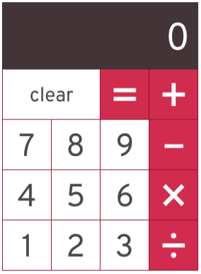

# Présentation React-Native

[REACT-NATIVE](https://docs.google.com/presentation/d/1ltq8oOECssLjEKni3L6wFwQ9jzM3BqC44xyzydjiHEc/edit?usp=sharing)

# Petit Exercice Calculatrice

## Consignes

- Créer une application React Native
- Créer une calculatrice à partir de la maquette ci-dessous
- Chaques boutons doit être un composant à part entière et cliquable
- L'appui sur un bouton doit afficher le chiffre dans l'écran de la calculatrice
- L'appui sur le bouton `=` déclenche une fonction qui doit calculer le résultat de l'opération
- Lorsque l'on remue le téléphone, la calculatrice doit se réinitialiser

## Maquette

https://www.npmjs.com/package/react-native-shake

# Petit Exercice Integration

## Consignes

- Créer une application React Native
- Recréer la page d'accueil du Garage404 à partir de la maquette ci-dessous
- Les boutons doivent être cliquables sans redirection
- Le menu burger doit être cliquable et afficher un menu déroulant

## Maquette

https://garage404.com/

# Tuto complet Youtube

[Home Service App](https://www.youtube.com/watch?v=Zs-W12TpAeM)
